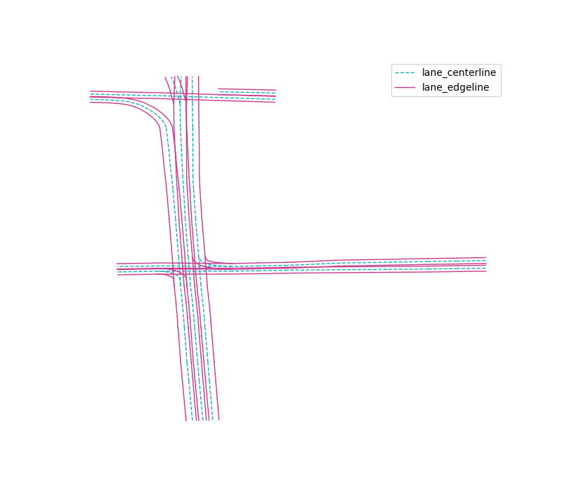
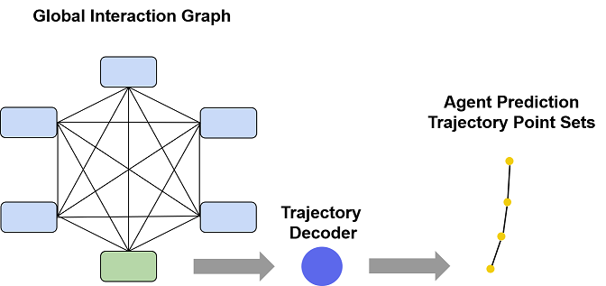

# VectorNet implementation

## Usage

The data folder have following structure:
```
data
|--argoverse-forecasting
|  |--forecasting_sample
|  |  |--data
|  |  |  |--xxxx.csv
|  |  |  |--...
|  |--forecasting_train_v1.1
|  |  |--data
|  |  |  |--xxx.csv
|  |  |  |--...
|  |--forecasting_val_v1.1
|  |  |--data
|  |  |  |--xxx.csv
|  |  |  |--...
|  |
```
  
```
python test_forward_backward.py
```

## Negetive Gaussion loglikehood

首先参考似然函数的形式:  
  
而后是对数似然函数的形式:  
  
高斯分布的函数为:  
  
对应的负对数似然函数:  
  

## Representing HD maps and trajectories

训练与测试都是以 scenario 为单元的, 一个 scenario 总共包括 5s 内 agent, AV, OTHER 对象的位置坐标, 根据这些位置坐标我们能够从原始的 HD map 中截取与当前 scenario 有关的 map 片段来进行推理预测, 由于我们不需要关注人形横道, 以及道路的属性, 例如, 限速, 交通灯, 交通标志等等， 那么 HD map 的表征几乎只剩下道路的方向和位置了, 而且我们只需要关注 agent 这一个 object, 那么我们需要向量化来表征的就只有两项了: agent trajectory 以及 lane. agent trajectory 需要注意的是, 在 VectorNet[[1]](#ref1) 中提到仅将 (0s, 2s] 的轨迹作为推理, 而将 [2s, 5s) 的轨迹作为预测, 最终我们的预测目标是预测部分的点集, 这里总共有 50 个坐标点, 那么此时推理部分需要 20 个坐标点, 而预测部分需要 30 个坐标点, 那么推理部分的向量为 19 个, 而预测部分则保留为 30 个坐标点. 这里 agent 的所有 trajectory 构成一个 polyline. 而对于 lane 的表征, 这里有两种表征: lane center line, lane two-side edge line:  
  
  
  
附加上 agent trajectory:
  

  
根据 [[1]](#ref1) 中的 Figure 2, 似乎是用 lane two-side edge line 来表征 lane, lane two-side edge line 也是通过坐标点来表征的, 我梦恩据坐标点将其向量化, 这里 lane 被分为了很多小段而一小段 lane 就构成一个 polyline. 这里由于 [[1]](#ref1) 中提到了要将以最后一个推理部分的观测点作参考, 所以我们所有的坐标点都减去了当前 scenario 下最后一个观测点即 agent trajectory 在 2s 时的坐标. 

这里将向量化的具体过程可视化出来，首先收集 lane two-side edge line, observed trajectory, future trajectory 的采样点, 而后将相邻的两个采样点使用向量连接起来:  

  
  
而后再将其向量化将点集转化为向量集，由于我们的目标是预测出未来的轨迹采样点，所以我们保留了未来轨迹的采样点，而没有将其向量化:  
  

  
完整流程汇总如下:  
  


## Constructing the polyline subgraphs

这一步其实我觉得有点像 embedding 层的作用, 例如 word2vec 将非欧几里德数据文字转化为特征向量, 这一步的主要目的也是将 map 表征以及 agent trajectory 表征为特征向量的形式. 特征向量似乎是以 polyline 为单位的. VectorNet 中给出了比较粗略的计算流程:  
  
  
  
而我们将这些流程具体化之后则变为 (我们将 width 设为 128, depth 待定):  
  
  
  
每一个 polyline 的每一个 vector 会被 embedding 层转化为特征向量, 而后在经过 aggregate 聚合成单个特征向量, 这个特征向量就是 polyline 的特征表征. 我们注意一点细节, 当原始的 lane, trajectory 所在的 polyline 被编码时, 这里的 MLP 也就是 Node Encoder 具体的计算操作也许是这样:   
  


## Global graph

全局网络通过 GNN 之后会将所有的节点都更新一遍, 而这些更新了的节点中的与 agent trajectory 有关的项就可以提取出来使用 decoder 来解码, 通过解码之后直接预测出接下来时间 [2s, 5s) 内的所有轨迹点。~~并预测下一时刻的向量, 而重要的是我们需要预测接下来的 [2s, 5s) 的所有 trajectory 向量, 所以需要通过输入已经预测出来的 trajectory 向量合并到 agent 的 polyline 重新计算与 agent trajectory 有关的节点, 来预测已经预测出来的时刻的下一时刻.~~  
  
  
  
## Argoverse dataset

Argoverse[[2]](#ref2) 数据集似乎提供了 Miami 和 Pittsburgh 两个城市的 HD map 以及在这两个城市记录的 agent 和 AV (Autonomous Vehicle) 的运动路径. 同时还提供了 3D 追踪的 bbox 标注, 不过我们并不需要用到. 我们主要使用数据集的 Motion Forecasting 部分. 数据集将每个 agent 以及 AV 还有 other 对象的运动序列组装为一个文件, 其中 AV 不仅仅是自动驾驶汽车, 同时也是测量设备的所在处, 每个运动序列由 5s 构成, 而采样频率是 10Hz, 则意味着 5s 采样了 50 个坐标点, 单个文件中包含的所有关于对象们的运动序列的信息又被称为 scenario, 数据集一共有 324557 个 scenario, 官方将其划分为了训练集, 验证集, 测试集, 其中训练集中有大约 211K 个 scenario, 验证集大约有 41K 个 scenario, 测试集大约有 80K 个 scenario.  


## 关于 Self-Attention 的一些理解

之前一直纠结于图像的注意力机制, 图像是一种欧几里德数据, 图像的注意力机制往往是在某些维度上添加一层带有权值掩膜, 例如通道注意力机制 Squeeze-and-excitation, 空间注意力机制 Attention Gate, 更特殊一点的则有 Non-local 与 self-attention 很像, 通过矩阵乘法来为特征图加权, 而还有多尺度特征实际上也是一种注意力机制, 只不过注意力机制的作用域在于尺度域, 将不同尺度的信息聚合然后卷积来聚合特征就完成了加权, 综合来看 Attention 机制就是一种给特征信息加权的策略.  
非欧几里德的其他的数据不能被规则表达, 一般需要 embedding 层来将其转换成神经网络比较好学习的形式, Self-Attention 被于 NLP 任务中提出, 要理解其中的 Q,k,V 我们得先理解常规的 NLP Attention 的概念, 为了方便理解, 我们将 key, value, query 都看作特征向量的形式, key 与 value 是两组一一对应的特征向量集合，key 和 value 是可以相等的也可以不相等, 其中 value 是原特征表征, 而 key 可以是原特征表征也可以是其他的表征, key 和 query 的选择取决于你想使用什么信息对原特征进行加权或者 Attention. 在常规的 NLP Attention 机制中 key 与 value 是相同的, 而 query 的选取则根据具体任务的不同而不同. 在 Self-Attention 中 key, value, query 都是原特征信息这就是为什么 Self-Attention 被称为 Self-Attention 的原因, 因为其是使用原特征信息来编码原特征信息的. 首先来看看 Self-Attention 的原理图 [[3]](#ref3):    
  
   
  
其中比较关键的就是 Multi-head Attention [[3]](#ref3), input embedding 被复制三次输入到其中分别作为 key, value, query  
  

  
V, k, Q 三个 embedding 特征向量经过线性层，即全连接层编码之后, 通过 K, Q 之间计算得到加权矩阵, 而后通过矩阵乘法将其叠加到 V 上.  

## self-driving relation paper

### Fast and Furious [[6]](#ref6)

FaF 是一个比较传统的轨迹预测网络，其主要成果在于能够将激光雷达扫描得到的 3D 点云体素化，将其转化为可被卷积的张量，其体素化的示意图如下:  
  
  
  
体素化变为张量之后，则通过卷积神经网络来同时实现目标检测，目标跟踪，轨迹预测，实际上这个就是一个端到端的各个常规计算机视觉任务混合的网络。  
  


### IntentNet [[7]](#ref7)

IntentNet 实际上和 FaF 很相似，不过他对比起 FaF 只输入激光雷达的 3D 点云数据还输入了自定义的 HD map，即通过各种颜色表征来代表各种语义信息:  
  
  
  
IntentNet 同时实现目标检测任务，意图检测任务，轨迹预测任务，通过查阅主 pipeline 就可以一目了然:  
  

  
这里关于轨迹预测还有一点就是，其实轨迹预测有两种方式，一种是 one-shot 的方式，即一次性回归出所有预测时间范围内的轨迹，一种是 recurrent 的方式，即以某个时间长度为间隔递归地预测轨迹，这个说法有在 Rules of the Road [[8]](#ref8) 中有提到。


## some problems

### The first item (solved)

<span id = "problem1"></span>

  
When outputting trajectory, the network need to output all trajectory points from 2s to 5s. 
  
### The second item

pass

## Interview

### 1. FFT 的计算复杂度是多少？

之前在学习信号与系统的时候，老师并未将其作为重点讨论而是仅作为拓展内容，所以借此机会再复习一下
要研究 FFT 的计算复杂度就得首先追究 DFT，DFT 的公式为:  
  

  
针对每一个 x(k) 都要进行 n 次计算，显然其复杂度为 O(n^2)，FFT 实际上是另一种 DFT 的实现方式，FFT 主要对原始的 DFT 算法采用了分治法来改进，即常规的 DFT 可以通过划分奇序列和偶序列而分裂成两个 DFT，而这两个 DFT 又可以继续分裂，就这样递归地分裂直到直接可解，由此 O(n^2) 降为了 O(nlog2n)  

### 2. 线程与进程是什么？

专业来讲:  
进程是操作系统资源调度的最小单元  
线程是 CPU 资源调度的最小单元  
(学半导体真心不太懂这个)

### 3. 均方差和极大似然估计的区别？

这个答得不是很好，我答的是均方差和高斯分布的极大对数似然估计在数学表达式上比较接近，高斯分布的极大对数似然估计只是均方差公式再多加了几个项而已，其实主要是想到了 VectorNet 的损失函数表达式，即高斯分布的极大对数似然估计函数表达式，好像确实就是均方差加了几个项而已。  
  
查阅相关资料发现，这二者似乎在某种情况下是等价的，[使用这二者来对某个分布下的事件进行估计的时候得到的概率是相同的](https://blog.csdn.net/qq_14997473/article/details/89230118)，不过似乎还是差一点接触到本质。

To be continued

### 4. 你用过什么无监督的模型？

答的是 [W-Net](#ref8) 大概老师也没太懂吧，其实应该慢点答的，在情感识别项目中就使用自编码器来提取图像自编码特征来更高效地进行情感建模，面试还是太慌张了一点，没有很好地表达自己的意思，除了自编码器还有聚类算法，主成分分析算法，例如，YOLO 计算先验 Anchor 时就有使用聚类算法，在医学数据分析的时候分析肿瘤诱发源的时候也使用过主成分分析算法。

## Reference

<span id = "ref1">[1] Gao J, Sun C, Zhao H, et al. VectorNet: Encoding HD Maps and Agent Dynamics from Vectorized Representation[J]. arXiv preprint arXiv:2005.04259, 2020.</span>  
<span id = "ref2">[2] Chang M F, Lambert J, Sangkloy P, et al. Argoverse: 3d tracking and forecasting with rich maps[C]//Proceedings of the IEEE Conference on Computer Vision and Pattern Recognition. 2019: 8748-8757.</span>  
<span id = "ref3">[3] Vaswani A, Shazeer N, Parmar N, et al. Attention is all you need[C]//Advances in neural information processing systems. 2017: 5998-6008.</span>  
[[4] NLP中的 Attention 机制](https://zhuanlan.zhihu.com/p/59698165)  
[[5] 自然语言处理中的自注意力机制（Self-attention Mechanism）](https://www.cnblogs.com/robert-dlut/p/8638283.html)  
<span id = "ref6">[6] Casas S, Luo W, Urtasun R. Intentnet: Learning to predict intention from raw sensor data[C]//Conference on Robot Learning. 2018: 947-956.</span>  
<span id = "ref7">[7] Luo W, Yang B, Urtasun R. Fast and furious: Real time end-to-end 3d detection, tracking and motion forecasting with a single convolutional net[C]//Proceedings of the IEEE conference on Computer Vision and Pattern Recognition. 2018: 3569-3577.</span>  
<span id = "ref8">[8] Hong J, Sapp B, Philbin J. Rules of the road: Predicting driving behavior with a convolutional model of semantic interactions[C]//Proceedings of the IEEE Conference on Computer Vision and Pattern Recognition. 2019: 8454-8462.</span>  
<span id = "ref9">[9] Xia X, Kulis B. W-net: A deep model for fully unsupervised image segmentation[J]. arXiv preprint arXiv:1711.08506, 2017.</span>  